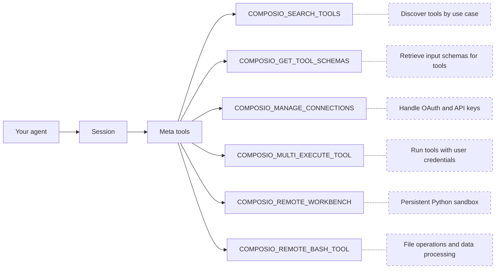

# How Composio works (/docs/how-composio-works)

Composio connects AI agents to external services like GitHub, Gmail, and Slack. Your agent gets a small set of meta tools that can discover, authenticate, and execute tools across hundreds of apps at runtime.

This page is a high-level overview. Each concept has a dedicated page with full details:

1. [Users & Sessions](/docs/users-and-sessions): how users and sessions scope tools and connections
2. [Authentication](/docs/authentication): Connect Links, OAuth, API keys, and auth configs
3. [Tools and toolkits](/docs/tools-and-toolkits): meta tools, discovery, and execution
4. [Workbench](/docs/workbench): persistent Python sandbox for bulk operations
5. [Triggers](/docs/triggers): event-driven payloads from connected apps

For hands-on setup, see the [quickstart](/docs/quickstart).

# Sessions

When your app calls `composio.create()`, it creates a session scoped to a user.

```python
composio = Composio()
session = composio.create(user_id="user_123")

# Get tools formatted for your provider
tools = session.tools()

# Or get the MCP endpoint for MCP-compatible frameworks
mcp_url = session.mcp.url
mcp_headers = session.mcp.headers
```

A session ties together:

* **A user**: whose credentials and connections to use
* **Available toolkits**: all by default, or a specific set you configure
* **Auth configuration**: which authentication method and connected accounts to use

Sessions are immutable. Their configuration is fixed at creation. If the context changes (different toolkits, different connected account), create a new session. You don't need to cache or manage session IDs.

- [Users & Sessions](/docs/users-and-sessions): How users and sessions scope tools and connections

# Meta tools

Rather than loading hundreds of tool definitions into your agent's context, a session provides [meta tools](/docs/tools-and-toolkits#meta-tools):



The agent searches for relevant tools, authenticates if needed, and executes them, all through these meta tools. For large responses or bulk operations, the agent offloads work to the workbench sandbox. Meta tool calls share context through a `session_id`, so the agent can search in one call and execute in the next without losing state.

Composio also surfaces **learned plans** from past executions: step-by-step workflows that have worked before for similar tasks, guiding the agent without starting from scratch.

- [Tools and toolkits](/docs/tools-and-toolkits): Full details on meta tools, discovery, and execution

# Authentication

When a tool requires authentication and the user hasn't connected yet, the agent uses `COMPOSIO_MANAGE_CONNECTIONS` to generate a **Connect Link**, a hosted page where the user authorizes access.

In a conversation, this looks like:

> **You:** Create a GitHub issue for the login bug
>
> **Agent:** You'll need to connect your GitHub account. Please authorize here: \
>
> **You:** Done
>
> **Agent:** Created issue #42 on your-org/your-repo.

Composio manages the OAuth flow end to end: redirects, token exchange, and automatic refresh. Connections persist across sessions. A user who connects GitHub once can use it in every future session without re-authenticating.

- [Authentication](/docs/authentication): Connect Links, OAuth, API keys, and custom auth configs

# Remote workbench

Large responses from `COMPOSIO_MULTI_EXECUTE_TOOL` are automatically synced to a secure remote workbench. Instead of stuffing thousands of lines into the context window, the agent can work with the data inside the workbench:

* **Reading** files and tool responses
* **Searching** across large outputs
* **Writing and executing** Python code to transform, filter, or aggregate data
* **Calling Composio tools** via the `run_composio_tool` helper for bulk orchestration

This keeps the agent's context window lean while still letting it handle operations like labeling hundreds of emails, processing CSV exports, or summarizing long API responses.

- [Workbench](/docs/workbench): Persistent Python sandbox for large-context operations

# What to read next

Start with the concepts in order, or jump to the quickstart to build right away:

- [Users & Sessions](/docs/users-and-sessions): How users and sessions scope tools and connections

- [Authentication](/docs/authentication): Connect Links, OAuth, API keys, and auth configs

- [Tools and toolkits](/docs/tools-and-toolkits): Meta tools, discovery, and execution

- [Quickstart](/docs/quickstart): Build your first agent

Deciding how to connect? See:

* [Native Tools vs MCP](/docs/native-tools-vs-mcp) — SDK vs MCP servers
* [Sessions vs Direct Execution](/docs/sessions-vs-direct-execution) — meta tools vs fetching specific tools

---

📚 **More documentation:** [View all docs](https://docs.composio.dev/llms.txt) | [Glossary](https://docs.composio.dev/llms.mdx/docs/glossary) | [Cookbooks](https://docs.composio.dev/llms.mdx/cookbooks) | [API Reference](https://docs.composio.dev/llms.mdx/reference)

---

# Composio SDK — Instructions for AI Code Generators

**Purpose:** Enforce only the **current** and **correct** patterns for integrating [Composio](https://composio.dev/) tools into AI agents.
**Scope:** All AI-generated code using Composio must follow these guardrails.

---

## 1. Correct Composio Integration

Composio supports two integration modes: **Native Tools** (with a provider package) and **MCP** (no provider package needed).

### Native Tools

```python
# ✅ CORRECT — Python (defaults to OpenAI)
from composio import Composio

composio = Composio()
session = composio.create(user_id="user_123")
tools = session.tools()
# Pass tools to your agent/LLM framework
```

```typescript
// ✅ CORRECT — TypeScript (defaults to OpenAI)
import { Composio } from "@composio/core";

const composio = new Composio();
const session = await composio.create("user_123");
const tools = await session.tools();
// Pass tools to your agent/LLM framework
```

For other providers, pass the provider explicitly. Provider packages follow the naming convention: `composio_<provider>` for Python, `@composio/<provider>` for TypeScript.

### MCP

Use `session.mcp.url` and `session.mcp.headers` with any MCP-compatible client (Claude Desktop, Cursor, OpenAI Agents, etc.). No provider package needed.

---

## 2. CRITICAL INSTRUCTIONS FOR AI MODELS

### 2.1 — ALWAYS DO THE FOLLOWING

1. **Use `composio.create(user_id)`** to create a session — this is the entry point for all Composio integrations.
2. **Use `session.tools()`** for native tool integration or **`session.mcp.url`** for MCP integration.
3. **Import** from the correct provider package (`composio_<provider>` for Python, `@composio/<provider>` for TypeScript).
4. **Pass `user_id` to `composio.create()`**, not to individual tool calls.

### 2.2 — NEVER DO THE FOLLOWING

1. **Do not** instruct users to manually create auth configs or connected accounts before running.
2. **Do not** import from `composio_openai` / `@composio/openai` when using OpenAI Agents SDK — use `composio_openai_agents` / `@composio/openai-agents` instead.

### 2.3 — DISCOURAGED (do not use unless user explicitly asks)

Do **not** generate `composio.tools.get()`, `composio.tools.execute()`, or `composio.provider.handle_tool_calls()` unless the user explicitly requests direct tool execution. These are a supported but **not recommended** low-level interface.


---

## Terminology Migration (old → current)

If you encounter these terms in error messages, old documentation, or user prompts, translate them to the current equivalents. **Do not use the old terms in generated code or explanations.**

| Old term (v1/v2) | Current term (v3) | In code |
|---|---|---|
| entity ID | user ID | `user_id` parameter |
| actions | tools | e.g., `GITHUB_CREATE_ISSUE` is a *tool* |
| apps / appType | toolkits | e.g., `github` is a *toolkit* |
| integration / integration ID | auth config / auth config ID | `auth_config_id` parameter |
| connection | connected account | `connected_accounts` namespace |
| ComposioToolSet / OpenAIToolSet | `Composio` class with a provider | `Composio(provider=...)` |
| toolset | provider | e.g., `OpenAIProvider` |

If a user says "entity ID", they mean `user_id`. If they say "integration", they mean "auth config". Always respond using the current terminology.

