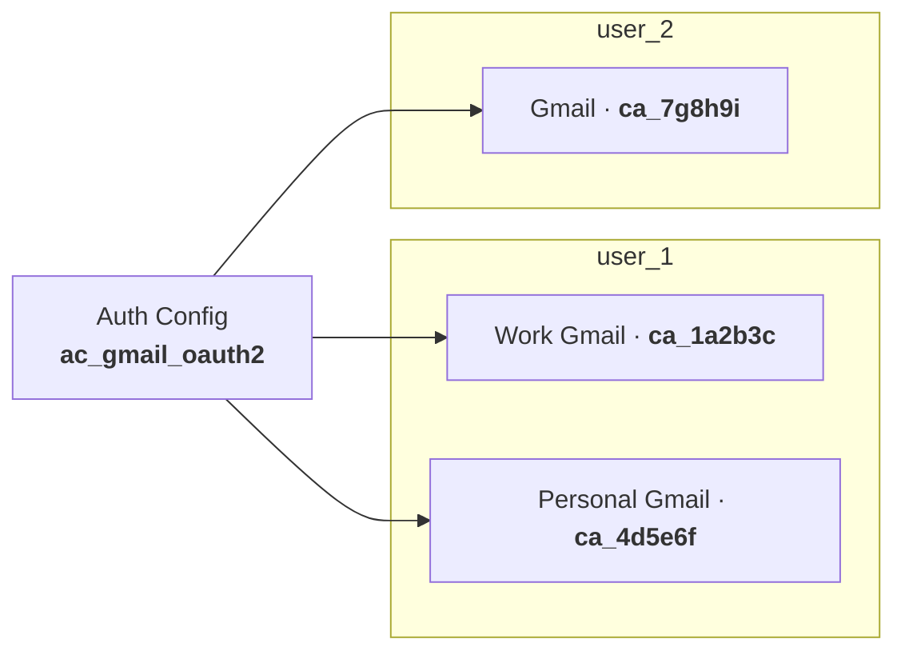

# Authentication (/docs/authentication)

Composio simplifies authentication with Connect Links: hosted pages where users securely connect their accounts. There are two approaches. Choose based on where in your app users should authenticate.

# Which approach should I use?

* **Users chat with your agent?** Use [in-chat authentication](#in-chat-authentication). The agent handles connection prompts automatically, no setup needed.
* **Want users connected before they chat?** Use [manual authentication](#manual-authentication). Your app calls `session.authorize()` during onboarding or from a settings page.

Not sure? Start with in-chat. You can add manual auth later.

# In-chat authentication

By default, when a tool requires authentication, the agent prompts the user with a Connect Link. The user authenticates and confirms in chat. No setup needed. Just create a session and the agent handles OAuth flows, token refresh, and credential management automatically.

> **You:** Summarize my emails from today
>
> **Agent:** I need you to connect your Gmail account first. Please click here to authorize: [https://connect.composio.dev/link/ln\_abc123](https://connect.composio.dev/link/ln_abc123)
>
> **You:** Done
>
> **Agent:** Here's a summary of your emails from today...

- [In-chat authentication guide](/docs/authenticating-users/in-chat-authentication): 
Configuration, callback URLs, and full examples

# Manual authentication

Use `session.authorize()` to generate Connect Links programmatically when you want to control when and where users authenticate. Common use cases:

* **Onboarding**: connect accounts during signup before the user ever chats with the agent
* **Settings page**: let users manage their connections from a dedicated UI
* **Pre-flight checks**: verify all required connections are active before starting a task

- [Manual authentication guide](/docs/authenticating-users/manually-authenticating): 
`session.authorize()` API, callback URLs, and connection status checks

# How Composio manages authentication

Behind the scenes, Composio uses **auth configs** to manage authentication.

An **auth config** is a blueprint that defines how authentication works for a toolkit across all your users. It specifies:

* **Authentication method**: OAuth2, Bearer token, API key, or Basic Auth
* **Scopes**: what actions your tools can perform
* **Credentials**: your own app credentials or Composio's managed auth

Composio creates one auth config per toolkit, and it applies to every user who connects that toolkit. When a user authenticates, Composio creates a **connected account** that stores their credentials (OAuth tokens or API keys) and links them to your user ID. When you need to use your own OAuth credentials or customize scopes, you can create [custom auth configs](/docs/using-custom-auth-configuration).



Composio handles this automatically:

1. When a toolkit needs authentication, we create an auth config using Composio managed credentials
2. The auth config is reused for all users authenticating with that toolkit
3. Connected accounts are created and linked to your users

**What are connected accounts?**

A connected account is created when a user authenticates with a toolkit. It stores the user's credentials (OAuth tokens or API keys) and links them to your user ID. Each user can have multiple connected accounts, even for the same toolkit (e.g., work and personal Gmail).

**What happens when tokens expire?**

Composio automatically refreshes OAuth tokens before they expire. You don't need to handle re-authentication or token expiration. Connected accounts stay valid as long as the user doesn't revoke access.

Most toolkits work out of the box with **Composio managed OAuth**. For API key-based toolkits, users enter their keys directly via Connect Link.

You only need to create a custom auth config when:

* You want to use your **own OAuth app credentials** for white-labeling
* You need **specific OAuth scopes** beyond the defaults
* The toolkit doesn't have Composio managed auth
* You have **existing auth configs** with connected accounts you want to use

To bring your own OAuth apps or customize scopes, see [custom auth configs](/docs/using-custom-auth-configuration).

# What to read next

- [Tools and toolkits](/docs/tools-and-toolkits): How meta tools discover, authenticate, and execute tools

- [In-chat authentication](/docs/authenticating-users/in-chat-authentication): Let the agent prompt users to authenticate during conversation

- [Manual authentication](/docs/authenticating-users/manually-authenticating): Generate Connect Links programmatically in your app

## Related guides

- [White-labeling](/docs/white-labeling-authentication): Customize OAuth screens with your branding

- [Custom auth configs](/docs/using-custom-auth-configuration): Use your own OAuth apps

---

📚 **More documentation:** [View all docs](https://docs.composio.dev/llms.txt) | [Glossary](https://docs.composio.dev/llms.mdx/docs/glossary) | [Cookbooks](https://docs.composio.dev/llms.mdx/cookbooks) | [API Reference](https://docs.composio.dev/llms.mdx/reference)

---

# Composio SDK — Instructions for AI Code Generators

**Purpose:** Enforce only the **current** and **correct** patterns for integrating [Composio](https://composio.dev/) tools into AI agents.
**Scope:** All AI-generated code using Composio must follow these guardrails.

---

## 1. Correct Composio Integration

Composio supports two integration modes: **Native Tools** (with a provider package) and **MCP** (no provider package needed).

### Native Tools

```python
# ✅ CORRECT — Python (defaults to OpenAI)
from composio import Composio

composio = Composio()
session = composio.create(user_id="user_123")
tools = session.tools()
# Pass tools to your agent/LLM framework
```

```typescript
// ✅ CORRECT — TypeScript (defaults to OpenAI)
import { Composio } from "@composio/core";

const composio = new Composio();
const session = await composio.create("user_123");
const tools = await session.tools();
// Pass tools to your agent/LLM framework
```

For other providers, pass the provider explicitly. Provider packages follow the naming convention: `composio_<provider>` for Python, `@composio/<provider>` for TypeScript.

### MCP

Use `session.mcp.url` and `session.mcp.headers` with any MCP-compatible client (Claude Desktop, Cursor, OpenAI Agents, etc.). No provider package needed.

---

## 2. CRITICAL INSTRUCTIONS FOR AI MODELS

### 2.1 — ALWAYS DO THE FOLLOWING

1. **Use `composio.create(user_id)`** to create a session — this is the entry point for all Composio integrations.
2. **Use `session.tools()`** for native tool integration or **`session.mcp.url`** for MCP integration.
3. **Import** from the correct provider package (`composio_<provider>` for Python, `@composio/<provider>` for TypeScript).
4. **Pass `user_id` to `composio.create()`**, not to individual tool calls.

### 2.2 — NEVER DO THE FOLLOWING

1. **Do not** instruct users to manually create auth configs or connected accounts before running.
2. **Do not** import from `composio_openai` / `@composio/openai` when using OpenAI Agents SDK — use `composio_openai_agents` / `@composio/openai-agents` instead.

### 2.3 — DISCOURAGED (do not use unless user explicitly asks)

Do **not** generate `composio.tools.get()`, `composio.tools.execute()`, or `composio.provider.handle_tool_calls()` unless the user explicitly requests direct tool execution. These are a supported but **not recommended** low-level interface.


---

## Terminology Migration (old → current)

If you encounter these terms in error messages, old documentation, or user prompts, translate them to the current equivalents. **Do not use the old terms in generated code or explanations.**

| Old term (v1/v2) | Current term (v3) | In code |
|---|---|---|
| entity ID | user ID | `user_id` parameter |
| actions | tools | e.g., `GITHUB_CREATE_ISSUE` is a *tool* |
| apps / appType | toolkits | e.g., `github` is a *toolkit* |
| integration / integration ID | auth config / auth config ID | `auth_config_id` parameter |
| connection | connected account | `connected_accounts` namespace |
| ComposioToolSet / OpenAIToolSet | `Composio` class with a provider | `Composio(provider=...)` |
| toolset | provider | e.g., `OpenAIProvider` |

If a user says "entity ID", they mean `user_id`. If they say "integration", they mean "auth config". Always respond using the current terminology.

