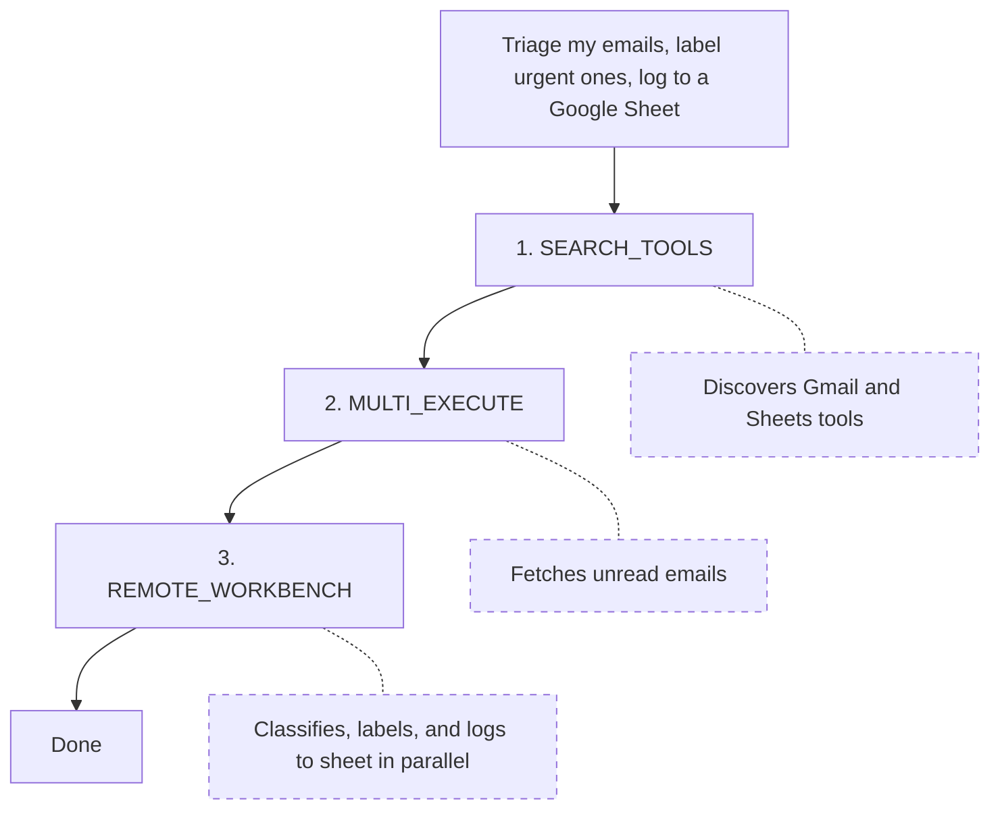

# Workbench (/docs/workbench)

The workbench is a persistent Python sandbox where your agent can write and execute code. It has access to all Composio tools programmatically, plus helper functions for calling LLMs, uploading files, and making API requests. State persists across calls within a [session](/docs/users-and-sessions). The `COMPOSIO_REMOTE_BASH_TOOL` meta tool also runs commands in the same sandbox.

> The workbench is part of the [meta tools](/docs/tools-and-toolkits#meta-tools) system. It's available when you create sessions, not when [executing tools directly](/docs/tools-direct/executing-tools).

# Where it fits

Your agent starts with [`SEARCH_TOOLS` to find the right tools, then uses `MULTI_EXECUTE`](/docs/tools-and-toolkits#meta-tools) for straightforward calls. When the task involves bulk operations, data transformations, or multi-step logic, the agent uses `COMPOSIO_REMOTE_WORKBENCH` instead.



# What the sandbox provides

## Built-in helpers

These functions are pre-initialized in every sandbox:

| Helper               | What it does                                                                                          |
| -------------------- | ----------------------------------------------------------------------------------------------------- |
| `run_composio_tool`  | Execute any Composio tool (e.g., `GMAIL_SEND_EMAIL`, `SLACK_SEND_MESSAGE`) and get structured results |
| `invoke_llm`         | Call an LLM for classification, summarization, content generation, or data extraction                 |
| `upload_local_file`  | Upload generated files (reports, CSVs, images) to cloud storage and get a download URL                |
| `proxy_execute`      | Make direct API calls to connected services when no pre-built tool exists                             |
| `web_search`         | Search the web and return results for research or data enrichment                                     |
| `smart_file_extract` | Extract text from PDFs, images, and other file formats in the sandbox                                 |

## Libraries

Common packages like pandas, numpy, matplotlib, Pillow, PyTorch, and reportlab are pre-installed. Beyond these, the workbench maintains a list of supported packages and their dependencies. If the agent uses a package that isn't already installed, the workbench attempts to install it automatically.

## Error correction

The workbench corrects common mistakes in the code your agent generates. For example, if a script accesses `result["apiKey"]` but the actual field name is `api_key`, the workbench resolves the mismatch instead of failing.

## Persistent state

The sandbox runs as a persistent Jupyter notebook. Variables, imports, files, and in-memory state from one call are available in the next.

# Common patterns

## Bulk operations across apps

Some tasks touch hundreds of items across services. Say you need to triage 150 unread emails. The agent writes a workbench script: classify each email with `invoke_llm`, apply Gmail labels with `run_composio_tool`, and log results to a Google sheet.

## Data analysis and reporting

The agent can chain tools inside the sandbox. Fetch GitHub activity, aggregate with pandas, chart with matplotlib, summarize with `invoke_llm`, upload a PDF with `upload_local_file`.

## Multi-step workflows

The sandbox preserves variables and files across calls. The agent can paginate through records, transform them, and write to a destination over multiple calls.

# What to read next

- [Users & Sessions](/docs/users-and-sessions): How sessions scope tools, auth, and workbench state to a user

- [Tools and toolkits](/docs/tools-and-toolkits): How meta tools discover, authenticate, and execute tools at runtime

- [Triggers](/docs/triggers): Event-driven payloads from connected apps

---

📚 **More documentation:** [View all docs](https://docs.composio.dev/llms.txt) | [Glossary](https://docs.composio.dev/llms.mdx/docs/glossary) | [Cookbooks](https://docs.composio.dev/llms.mdx/cookbooks) | [API Reference](https://docs.composio.dev/llms.mdx/reference)

---

# Composio SDK — Instructions for AI Code Generators

**Purpose:** Enforce only the **current** and **correct** patterns for integrating [Composio](https://composio.dev/) tools into AI agents.
**Scope:** All AI-generated code using Composio must follow these guardrails.

---

## 1. Correct Composio Integration

Composio supports two integration modes: **Native Tools** (with a provider package) and **MCP** (no provider package needed).

### Native Tools

```python
# ✅ CORRECT — Python (defaults to OpenAI)
from composio import Composio

composio = Composio()
session = composio.create(user_id="user_123")
tools = session.tools()
# Pass tools to your agent/LLM framework
```

```typescript
// ✅ CORRECT — TypeScript (defaults to OpenAI)
import { Composio } from "@composio/core";

const composio = new Composio();
const session = await composio.create("user_123");
const tools = await session.tools();
// Pass tools to your agent/LLM framework
```

For other providers, pass the provider explicitly. Provider packages follow the naming convention: `composio_<provider>` for Python, `@composio/<provider>` for TypeScript.

### MCP

Use `session.mcp.url` and `session.mcp.headers` with any MCP-compatible client (Claude Desktop, Cursor, OpenAI Agents, etc.). No provider package needed.

---

## 2. CRITICAL INSTRUCTIONS FOR AI MODELS

### 2.1 — ALWAYS DO THE FOLLOWING

1. **Use `composio.create(user_id)`** to create a session — this is the entry point for all Composio integrations.
2. **Use `session.tools()`** for native tool integration or **`session.mcp.url`** for MCP integration.
3. **Import** from the correct provider package (`composio_<provider>` for Python, `@composio/<provider>` for TypeScript).
4. **Pass `user_id` to `composio.create()`**, not to individual tool calls.

### 2.2 — NEVER DO THE FOLLOWING

1. **Do not** instruct users to manually create auth configs or connected accounts before running.
2. **Do not** import from `composio_openai` / `@composio/openai` when using OpenAI Agents SDK — use `composio_openai_agents` / `@composio/openai-agents` instead.

### 2.3 — DISCOURAGED (do not use unless user explicitly asks)

Do **not** generate `composio.tools.get()`, `composio.tools.execute()`, or `composio.provider.handle_tool_calls()` unless the user explicitly requests direct tool execution. These are a supported but **not recommended** low-level interface.


---

## Terminology Migration (old → current)

If you encounter these terms in error messages, old documentation, or user prompts, translate them to the current equivalents. **Do not use the old terms in generated code or explanations.**

| Old term (v1/v2) | Current term (v3) | In code |
|---|---|---|
| entity ID | user ID | `user_id` parameter |
| actions | tools | e.g., `GITHUB_CREATE_ISSUE` is a *tool* |
| apps / appType | toolkits | e.g., `github` is a *toolkit* |
| integration / integration ID | auth config / auth config ID | `auth_config_id` parameter |
| connection | connected account | `connected_accounts` namespace |
| ComposioToolSet / OpenAIToolSet | `Composio` class with a provider | `Composio(provider=...)` |
| toolset | provider | e.g., `OpenAIProvider` |

If a user says "entity ID", they mean `user_id`. If they say "integration", they mean "auth config". Always respond using the current terminology.

